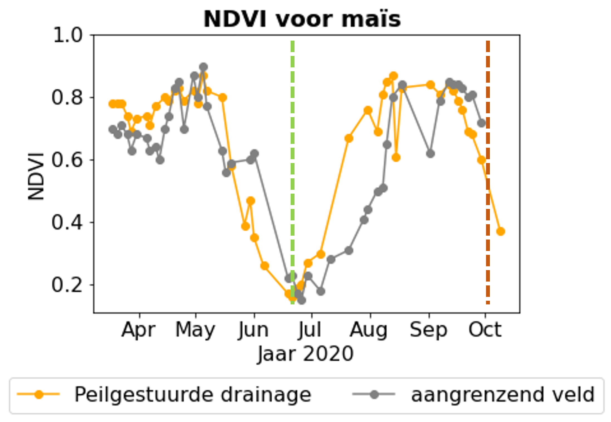

## Met satellietgegevens de invloed van peilgestuurde drainage beoordelen

Tijdsreeksen van satellietbeelden maken het mogelijk de impact van peilgestuurde drainage op de ontwikkeling van teelten tijdens 
extreme weersomstandigheden na te gaan. De analyse van dit soort beelden van verschillende velden in de provincies 
Limburg en Antwerpen in 2020 en 2021, toonde de positieve invloed van peilgestuurde drainage-installaties op zandgronden aan. 
Voor deze beoordeling gebruikten we onder andere de gewasindicator NDVI afgeleid van de vrij beschikbare beelden van de Sentinel 2 satellietmissie.

In het droge jaar 2020 hadden de teelten op velden met peilgestuurde drainage een hogere NDVI dan aangrenzende 
percelen zonder peilgestuurde drainage (zie onderstaande afbeelding voor een perceel met maïs). 
Dit contrast was het duidelijkst van begin juli tot half augustus, een periode waarin minder water beschikbaar was voor 
de landbouw in de regio.
 

Tijdens natte seizoenen, zoals in 2021, vertoonden gewassen onder peilgestuurde drainage een klein verschil met naburige 
percelen. Deze bevindingen suggereren dat peilgestuurde drainage, bij adequaat beheer, op een vergelijkbare manier werkt 
als traditionele drainage, waardoor schade aan gewassen door wateroverlast wordt voorkomen en toch, over het jaar heen, meer water 
wordt vastgehouden.

Deze bevindingen tonen aan dat gecontroleerde drainagesystemen de ontwikkeling van gewassen tijdens periodes van intense 
droogte kunnen optimaliseren in zandbodems. Ze onderschrijven ook het vermogen van teledetectie om de voordelen van gecontroleerde 
drainagesystemen te detecteren. Met deze techniek willen we nu ook de geschiktheid van peilgestuurde drainage in andere bodemtypes onderzoeken.

> Om de resultaten en conclusies uit te breiden naar andere regio's in Vlaanderen, is het cruciaal om velden op te nemen 
in onze test-databank waarvan we zeker weten dat peilgestuurde drainage is geïmplementeerd. We doen daarom beroep op jullie,
landbouwers en landbouworganisaties, om nieuwe sites aan te dragen voor dit doel. Deze gegevens zullen vertouwerlijk behandeld 
worden. *Door je peilgestuurd perceel door te geven, kan je actief bijdragen aan een beter begrip van de werking van
peilgestuurde drainage in Vlaanderen!*

Dit werk kwam tot stand in een recente studie, ontwikkeld als onderdeel van een masterproef aan de KU Leuven en de VUB, binnen het 
VLAIO-LA traject OP-PEIL. Van zodra deze thesis online beschikbaar is, zullen we de link hier ook toevoegen. 