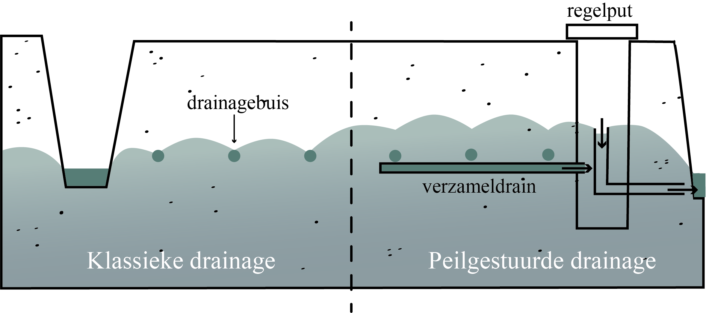

De algemene strategische doelstelling is de doorbraak op korte termijn van PGD-systemen in Vlaanderen 
die zowel maatschappelijk als landbouwkundig rendabel en effectief zijn. Deze doelstelling wordt bereikt door:
* Het verder opbouwen en samenbrengen van de kennis die de afgelopen jaren vergaard is rond PGD in Vlaanderen, 
met nadruk op de meerwaarde die PGD kan betekenen in de strijd tegen verdroging en voor de bedrijfsvoering en 
financiële meeropbrengst voor de landbouwer. 
Specifiek wordt er ook de nodige vakkennis opgebouwd rond 3 kennishiaten: 
    1. het potentieel van subirrigatie via PGD, 
    2. de invloed van PGD op het zoet-zoutvlak in de poldercontext, en 
    3. de mogelijkheden voor waterbeheer op landschapsschaal.
* Het aanbieden van beslissingsondersteunende richtlijnen en praktische aanbevelingen aan bedrijven 
over de perceelsspecifieke toepassing van PGD.
* Het stimuleren en begeleiden van doelgroepbedrijven bij de omvorming van klassieke naar PGD, 
met de nadruk op het aanleggen van een haalbaar en financieel rendabel PGD-systeem.
* Het maximaal uitdragen van de kennis rond PGD, zowel door het projectteam als door de landbouwers van de doelgroepbedrijven, 
aan de hand van demonstratieactiviteiten en workshops.

OP-PEIL is een LA-traject gefinancierd door het Vlaams Agentschap Innoveren en Ondernemen - VLAIO tussen Nov 2021 - Okt 2025.